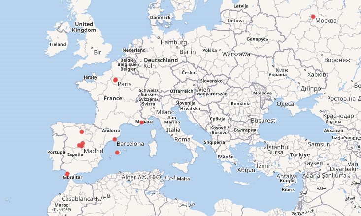

# Spanish-Civil-War-KGs
Extracting Knowledge Graphs as Collections as Data using the Spanish Civil War as main topic

### Introduction
This project intends to analyse the options and potential of Wikidata to extract Collections as Data from Wikidata using the Spanish Civil War and Exile as main topic.

The data was retrieved from the [National Archives in Spain](https://www.cultura.gob.es/en/cultura/areas/archivos/mc/centros/cida/4-difusion-cooperacion/4-1-guias-de-lectura/guia-exilio-espanol-1939-archivos-estatales.html), and enriched in Wikidata.

### Artists from the Republic and Spanish Civil War

This example is based on the book Artistas de la República which documents relevant artists related to the Republic and Spanish Civil War. The VALUES instruction enables the inclusion of a list of Wikidata identifiers representing a selection of the artists described in this book.

```
PREFIX wdt: <http://www.wikidata.org/prop/direct/>
PREFIX wd: <http://www.wikidata.org/entity/>

CONSTRUCT {
    ?artist wdt:P31 ?type .
    ?artist wdt:P19 ?placeBirth . 
    ?placeBirth rdfs:label ?placeBirthLabel .
    ?artist wdt:P20 ?placeDeath . 
    ?placeDeath rdfs:label ?placeDeathLabel .
    ?artist wdt:P569 ?dateBirth .
    ?artist wdt:P570 ?dateDeath .
    ?artist wdt:P135 ?movement .
    ?artist rdfs:label ?artistLabel .
    ?artist wdt:P18 ?image .
    ?artist wdt:P21 ?sex .
} WHERE { 
    VALUES ?artist {
        wd:Q5593 wd:Q152384 wd:Q2447692 wd:Q235275 wd:Q5660510 
        wd:Q118936 wd:Q979226 wd:Q134644 wd:Q921933 wd:Q5994858 
        wd:Q1042706 wd:Q3398317 wd:Q51545 wd:Q467712 wd:Q77347 wd:Q236161}
    ?artist wdt:P31 ?type .
    ?artist wdt:P19 ?placeBirth . 
    ?placeBirth rdfs:label ?placeBirthLabel . FILTER (lang(?placeBirthLabel) = 'es') .
    ?artist wdt:P20 ?placeDeath . 
    ?placeDeath rdfs:label ?placeDeathLabel . FILTER (lang(?placeDeathLabel) = 'es') .
    ?artist wdt:P569 ?dateBirth .
    ?artist wdt:P570 ?dateDeath .
    OPTIONAL {?artist wdt:P135 ?movement} .
    ?artist rdfs:label ?artistLabel . FILTER (lang(?artistLabel) = 'es') .
    OPTIONAL {?artist wdt:P18 ?image} .
    OPTIONAL {?artist wdt:P21 ?sex} .
}
```

### Refugee ships helping during the Spanish exile and the Spanish Civil War
SPARQL query to retrieve the ships helping during the Spanish exile and the Spanish Civil War. Note that the property wdt:P4813 is used to connect Wikidata entities with the resources provided by the Guide to the Spanish Exile of 1939 in the State Archives.

```
CONSTRUCT{
  ?ship wdt:P31 wd:Q697196 .
  ?ship wdt:P4813 ?idpares.
  ?ship rdfs:label ?shipLabel
}
WHERE {
   VALUES ?ship {
   wd:Q134521282 wd:Q134521348 wd:Q134521359 wd:Q134521371 wd:Q134521374 wd:Q134521381 wd:Q134521385 wd:Q134521390 wd:Q134521396 wd:Q134521407 wd:Q134521412 wd:Q134570422 wd:Q134570447 wd:Q134570475 wd:Q134570485
   wd:Q134570495 wd:Q134570519 wd:Q134570523 wd:Q134570537 wd:Q134570543 wd:Q3297717 wd:Q5484985 wd:Q7277080 wd:Q11696214 wd:Q28517197 wd:Q7394258 wd:Q7872486 wd:Q103825662 wd:Q85798975 wd:Q7874136}
  ?ship wdt:P31 wd:Q697196 .
  ?ship wdt:P4813 ?idpares.
  ?ship rdfs:label ?shipLabel . FILTER (lang(?shipLabel) = 'en') 
}
```

### French refugee camps, which concentrated the Spanish Republican exiles of 1939
SPARQL query to retrieve the French refugee camps, which concentrated the Spanish Republican exiles of 1939. Note that the property wdt:P4813 is used to connect Wikidata entities with the resources provided by the Guide to the Spanish Exile of 1939 in the State Archives.

```
PREFIX wdt: <http://www.wikidata.org/prop/direct/>
PREFIX wd: <http://www.wikidata.org/entity/>

CONSTRUCT {
  ?camp wdt:P31 ?type .
  ?camp wdt:P4813 ?idpares.
  ?camp rdfs:label ?label.
  ?camp wdt:P17 ?country .
  ?camp wdt:P131 ?location .
  ?camp wdt:P244 ?loc .
  ?camp wdt:P580 ?starttime .
  ?camp wdt:P582 ?endtime .
  ?camp wdt:P571 ?inception .
  ?camp wdt:P576 ?dissolved .
  ?camp wdt:P5630 ?prisoners .
  ?camp wdt:P18 ?image .
  ?camp wdt:P2046 ?area .
}
WHERE {
  VALUES ?type {wd:Q152081 wd:Q2935245 wd:Q5996900}
  VALUES ?camp {
      wd:Q11911061 wd:Q1579889 wd:Q2935277 wd:Q18191950 wd:Q973585 
      wd:Q133978695 wd:Q133978879 wd:Q1604600 wd:Q1668052 wd:Q45501756 
      wd:Q708638 wd:Q133979733 wd:Q45503576 wd:Q133979399 wd:Q133979241 wd:Q325332}
  ?camp wdt:P31 ?type .
  ?camp wdt:P4813 ?idpares.
  ?camp rdfs:label ?label . FILTER (lang(?label) = 'es') .
  ?camp wdt:P17 ?country .  
  OPTIONAL{?camp wdt:P131 ?location .}
  OPTIONAL{?camp wdt:P244 ?loc .}
  OPTIONAL{?camp wdt:P580 ?starttime .}
  OPTIONAL{?camp wdt:P582 ?endtime .}
  OPTIONAL{?camp wdt:P571 ?inception .}
  OPTIONAL{?camp wdt:P576 ?dissolved .}
  OPTIONAL{?camp wdt:P5630 ?prisoners .}
  OPTIONAL{?camp wdt:P18 ?image .}
  OPTIONAL{?camp wdt:P2046 ?area .}
}
```

### Retrieving bibliographic records related to the Spanish Civil War from the Biblioteca Virtual Miguel de Cervantes LOD repository
SPARQL query to retrieve up to 100 works related to the subject "España -- Historia -- 1936-1939 (Guerra civil)" from the Biblioteca Virtual Miguel de Cervantes LOD repository.

```
PREFIX rdac: <http://rdaregistry.info/Elements/c/>
PREFIX rdaw: <http://rdaregistry.info/Elements/w/>

SELECT * 
WHERE {
    ?s rdf:type rdac:Work .
    ?s rdaw:author ?author .
    ?s dc:subject "España -- Historia -- 1936-1939 (Guerra civil)" .
    ?s rdaw:titleOfTheWork ?title .
    OPTIONAL {?s rdaw:formOfWork ?form}
} 
LIMIT 100
```

### Map visualisation example
SPARQL query to retrieve a mpa illustrating the death places of a selection of artists from the Republic and Spanish Civil War in Wikidata.

```
#defaultView:Map
SELECT *
WHERE { 
    VALUES ?artist {wd:Q5593 wd:Q152384 wd:Q2447692 wd:Q235275 wd:Q5660510 
        wd:Q118936 wd:Q979226 wd:Q134644 wd:Q921933 wd:Q5994858 
        wd:Q1042706 wd:Q3398317 wd:Q51545 wd:Q467712 wd:Q77347 wd:Q236161}
    ?artist wdt:P31 ?type .
    ?artist wdt:P20 ?deathplace .
    ?deathplace wdt:P625 ?coord .
    SERVICE wikibase:label { bd:serviceParam wikibase:language "[AUTO_LANGUAGE],en". }
}
```



## Notebooks included

- [French refugee camps](https://nbviewer.org/github/hibernator11/Spanish-Civil-War-KGs/blob/main/notebooks/Extract-French-refugee-camps.ipynb): Example to retrieve the French refugee camps, which concentrated the Spanish Republican exiles of 1939.
- [Artists](https://nbviewer.org/github/hibernator11/Spanish-Civil-War-KGs/blob/main/notebooks/Extract-artists.ipynb): Example to retrieve artists from the Republic and Spanish Civil War.
- [Exile ships](https://nbviewer.org/github/hibernator11/Spanish-Civil-War-KGs/blob/main/notebooks/Extract-ships.ipynb): Example to retrieve exile ships.


## Running the notebooks
**To execute the notebook in Binder:**

[](https://mybinder.org/v2/gh/hibernator11/Spanish-Civil-War-KGs/HEAD)

- Click the launch binder button above. Once the demo launches, click My_sample_notebook.ipynb in the file listing.
- Run the notebook by selecting Cell > Run All. You call also click the play button to run the notebook cell by cell. You will the output of each cell.
- You can edit the cells, and click on play to run and see the changes.


### Licence
<a rel="license" href="http://creativecommons.org/licenses/by/4.0/"></a><br />Content is licensed under a <a rel="license" href="http://creativecommons.org/licenses/by/4.0/">Creative Commons Attribution 4.0 International license</a>.

Please, note that the datasets used in this project have separate licences.

### References

-  Ramón Guerra de la Vega. 2015. Artistas de la República. ISBN 9788488271358
-  Gustavo Candela. 2025. Browsing Linked Open Data in Cultural Heritage: A Shareable Visual Configuration Approach. J. Comput. Cult. Herit. 18, 1, Article 9 (March 2025), 15 pages. https://doi.org/10.1145/3707647
-  https://www.cultura.gob.es/en/cultura/areas/archivos/mc/centros/cida/4-difusion-cooperacion/4-1-guias-de-lectura/guia-exilio-espanol-1939-archivos-estatales.html
